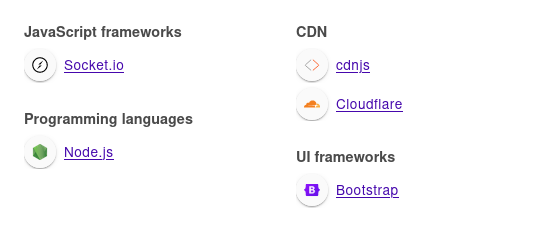
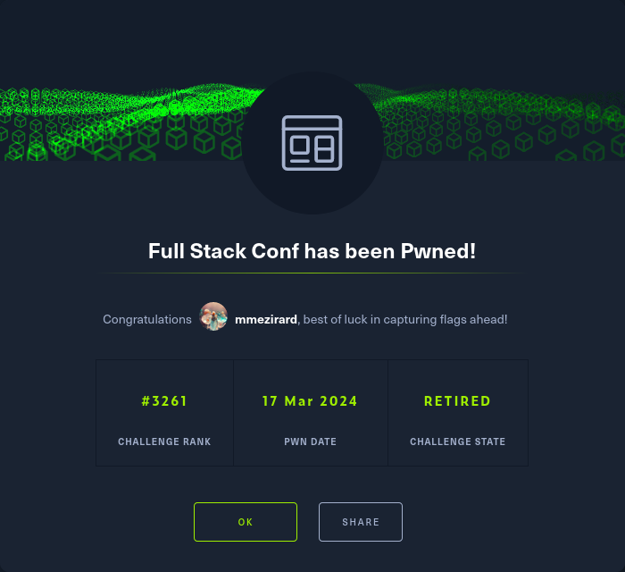

+++
title = "Full Stack Conf"
date = "2024-03-17"
description = "This is an easy Web challenge."
[extra]
cover = "cover.svg"
toc = true
+++

# Information

**Difficulty**: Easy

**Category**: Web

**Release date**: 2020-11-18

**Created by**: [makelarisjr](https://app.hackthebox.com/users/95) &
[makelaris](https://app.hackthebox.com/users/107)

**Description**: Welcome to Full Stack Conf, explore the future of JavaScript
with a lineup of industry professionals and discover new techniques to advance
your career as a web developer. But be very careful with the stay up to date
form, we don't sanitize anything and the admin logs in and checks the emails
regularly, don't try anything funny!! 😅

# Setup

I'll complete this challenge using a Kali Linux VM.

# Socket `94.237.62.195:49271`

## Exploration

Let's browse to `http://83.136.252.32:48648/`:

It's a website to register to the Full Stack Conf, a conference about
JavaScript.

## Fingerprinting

Let's fingerprint the technologies used by this web page with the
[Wappalyzer](https://www.wappalyzer.com/) extension.

This reveals that this web page is using Node.js.

Moreover, if we check the HTTP headers of the response, we find a `Server`
header indicating that the server is using the Werkzeug library `1.0.1` for
Python `3.8.6`.

## XSS

The website clearly states at the bottom of the page that we can use `alert` to
get the flag, the title of the page is `xss`, and the challenge description
informs us that the administrator logs in regularly to check its emails, so it's
crystal clear that we have to perform a stored XSS here.

I'll go with the simplest XSS payload I can think of:
``.

After a few seconds, the website opens a popup giving us the flag:
`HTB{p0p..p0p..p0p...alert(1337)}`.

# Afterwords

That's it for this box! 🎉

I rated this challenge as 'Piece of cake'. The path leading to the flag couldn't
be more obvious, and it was trivial to exploit.

Thanks for reading!
