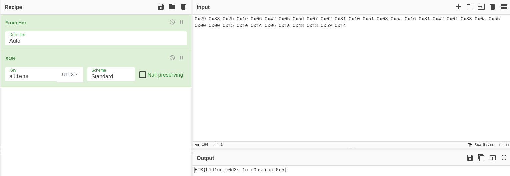

+++
title = "Rebuilding"
date = "2024-03-23"
description = "This is an easy Reversing challenge."
[extra]
cover = "cover.svg"
toc = true
+++

# Information

**Difficulty**: Easy

**Category**: Reversing

**Release date**: 2022-05-27

**Created by**: [clubby789](https://app.hackthebox.com/users/83743)

**Description**: You arrive on a barren planet, searching for the hideout of a
scientist involved in the Longhir resistance movement. You touch down at the
mouth of a vast cavern, your sensors picking up strange noises far below. All
around you, ancient machinery whirrs and spins as strange sigils appear and
change on the walls. You can tell that this machine has been running since long
before you arrived, and will continue long after you're gone. Can you hope to
understand its workings?

# Setup

I'll complete this challenge using a Kali Linux VM. I'll create a `workspace`
directory at `/` to hold all the files related to this challenge, and the
commands ran on my machine will be prefixed with `❯` for clarity.

# Files

```sh
❯ tree -a "/workspace"
```

```
/workspace
└── rev_rebuilding
    └── rebuilding

<SNIP>
```

This challenge is comprised of a single file named `rebuilding`.

# Static analysis

Let's start by statically analyzing the `rebuilding` file using the Rizin toolkit.

## Properties

Let's inspect the properties of this file.

```sh
❯ file "/workspace/rev_rebuilding/rebuilding"
```

```
rebuilding: ELF 64-bit LSB pie executable, x86-64, version 1 (SYSV), dynamically linked, interpreter /lib64/ld-linux-x86-64.so.2, for GNU/Linux 3.2.0, BuildID[sha1]=c7a145f3a4b213cf895a735e2b26adffc044c190, not stripped
```

This is an ELF 64-bit, LSB executable.

## Libraries

Let's find out which libraries are used by this binary.

```sh
❯ rz-bin -l "/workspace/rev_rebuilding/rebuilding"
```

```
[Libs]
library   
----------
libc.so.6
```

This binary uses the `libc.so.6` library, which provides the fundamental
functionalities for programs written in C.

## Imports

Now, let's find the list of objects imported by this binary.

```sh
❯ rz-bin -i "/workspace/rev_rebuilding/rebuilding"
```

```
[Imports]
nth vaddr      bind   type   lib name                        
-------------------------------------------------------------
1   0x000006c0 GLOBAL FUNC       putchar
2   ---------- WEAK   NOTYPE     _ITM_deregisterTMCloneTable
3   0x000006d0 GLOBAL FUNC       puts
4   0x000006e0 GLOBAL FUNC       strlen
5   0x000006f0 GLOBAL FUNC       printf
6   ---------- GLOBAL FUNC       __libc_start_main
7   ---------- WEAK   NOTYPE     __gmon_start__
8   0x00000700 GLOBAL FUNC       fflush
9   0x00000710 GLOBAL FUNC       exit
10  ---------- WEAK   NOTYPE     _ITM_registerTMCloneTable
11  0x00000730 WEAK   FUNC       __cxa_finalize
12  0x00000720 GLOBAL FUNC       usleep
```

This binary imports functions like `puts` and `printf`, but also `usleep`, so we
can expect to see text printed to the terminal and waiting times.

## Strings

Finally, let's retrieve the list of strings contained in this binary.

```sh
❯ rz-bin -z "/workspace/rev_rebuilding/rebuilding"
```

```
[Strings]
nth paddr      vaddr      len size section type  string                       
------------------------------------------------------------------------------
0   0x00000aa4 0x00000aa4 21  22   .rodata ascii Preparing secret keys
1   0x00000aba 0x00000aba 25  26   .rodata ascii Missing required argument
2   0x00000ad4 0x00000ad4 28  29   .rodata ascii Password length is incorrect
3   0x00000af1 0x00000af1 12  13   .rodata ascii \rCalculating
4   0x00000aff 0x00000aff 23  24   .rodata ascii The password is correct
5   0x00000b17 0x00000b17 25  26   .rodata ascii The password is incorrect
6   0x00001042 0x00201042 6   7    .data   ascii humans
```

According to these strings, the program expects an argument, and performs
calculations.

# Dynamic analysis

Now that we have an idea of what this binary could be doing, let's see what it
really does.

## Execution

Let's execute this binary on Linux.

```sh
❯ "/workspace/rev_rebuilding/rebuilding"
```

```
Preparing secret keys
Missing required argument
```

We're indeed asked to give the program an argument. I'll enter a random one:

```sh
❯ "/workspace/rev_rebuilding/rebuilding" "hello?"
```

```
Preparing secret keys
Password length is incorrect
```

# Static analysis

## Decompilation

I'll load `rebuilding` with the default options using Binary Ninja.

As usual, I'll start by exploring the `main` function.

### `main`

```c
int main(int argc, char **argv, char **envp) {
    if (argc != 2) {
        puts("Missing required argument");
        exit(EXIT_FAILURE);
    }

    if (strlen(argv[1]) != 32) {
        puts("Password length is incorrect");
        return EXIT_FAILURE;
    }

    int correctCharactersCount = 0;

    for (int i = 0; i < 32; i++) {
        printf("\rCalculating");

        for (int j = 0; j <= 5; j++) {
            char waitingCharacter;
            if (j != (i % 6)) {
                waitingCharacter = ' ';
            } else {
                waitingCharacter = '.';
            }
            putchar(waitingCharacter);
        }

        fflush(stdout);

        correctCharactersCount +=
            "\x29\x38\x2b\x1e\x06\x42\x05\x5d\x07\x02\x31\x10\x51\x08\x5a\x16"
            "\x31\x42\x0f\x33\x0a\x55\x00\x00\x15\x1e\x1c\x06\x1a\x43\x13\x59"
            "\x14"[i] ^
            "aliens"[i % 6] == argv[1][i];

        usleep(200000);
    }

    puts("");

    if (correctCharactersCount != 32) {
        puts("The password is incorrect");
        return EXIT_FAILURE;
    }

    puts("The password is correct");
    return 0;
}
```

This program checks if the given argument has a length of `32`. If it does, it
iterates over the first 32 character of the ciphertext
`\x29\x38\x2b\x1e\x06\x42\x05\x5d\x07\x02\x31\x10\x51\x08\x5a\x16\x31\x42\x0f\x33\x0a\x55\x00\x00\x15\x1e\x1c\x06\x1a\x43\x13\x59\x14`,
XOR's it with the corresponding character of the string `aliens` modulo `6`, and
check if it corresponds to the argument supplied by the user.

# Putting everything together

This is an example of a XOR cipher. This means that the flag has been encrypted
with a specific key, used for both encryption and decryption. Luckily for us,
this key is hardcoded in the program: it's `aliens`.

To obtain the result of the XOR encryption, I'll open
[CyberChef](https://gchq.github.io/CyberChef/) and I'll set the key to `aliens`.
Then, I'll cook:



We get the `HTB{h1d1ng_c0d3s_1n_c0nstruct0r5}` flag!

# Afterwords


That's it for this box! 🎉

I rated this challenge as 'Very easy'. The decompiled code was really close to
the reality, and it was easy to understand. The only shenanigan I had to face is
that the key actually changes when you launch the binary! That's really a sneaky
move from the challenge maker.

Thanks for reading!
