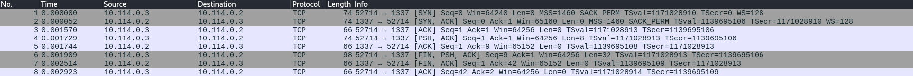
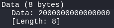
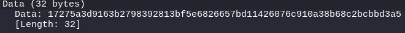
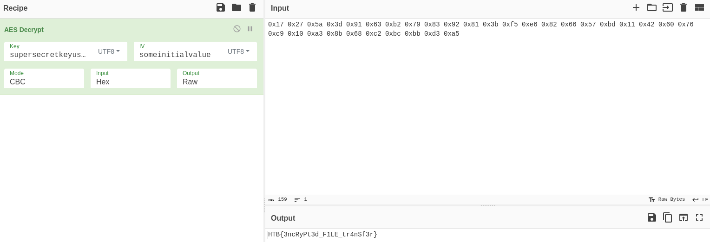

+++
title = "Secured Transfer"
date = "2024-03-14"
description = "This is an easy Reversing challenge."
[extra]
cover = "cover.svg"
toc = true
+++

# Information

**Difficulty**: Easy

**Category**: Reversing

**Release date**: 2022-11-18

**Created by**: [Leeky](https://app.hackthebox.com/users/129896)

**Description**: Ghosts have been sending messages to each other through the
aether, but we can't understand a word of it! Can you understand their riddles?

# Setup

I'll complete this challenge using a Kali Linux VM. I'll create a `workspace`
directory at `/` to hold all the files related to this challenge, and the
commands ran on my machine will be prefixed with `❯` for clarity.

# Files

```sh
❯ tree -a "/workspace"
```

```
/workspace
└── rev_securedtransfer
    ├── securetransfer
    └── trace.pcap

<SNIP>
```

This challenge is comprised of a file named `trace.pcap` and a file named
`securetransfer`. There's no extension, so we can infer that it's meant to be
run on Linux.

# Static analysis

Let's start by statically analyzing the `securetransfer` file using the Rizin
toolkit.

## Properties

Let's inspect the properties of this binary.

```sh
❯ rz-bin -I /workspace/rev_securedtransfer/securetransfer
```

```
[Info]
arch     x86
cpu      N/A
baddr    0x00000000
binsz    0x00003145
bintype  elf
bits     64
class    ELF64
compiler GCC: (Ubuntu 9.4.0-1ubuntu1~20.04.1) 9.4.0
dbg_file N/A
endian   LE
hdr.csum N/A
guid     N/A
intrp    /lib64/ld-linux-x86-64.so.2
laddr    0x00000000
lang     c
machine  AMD x86-64 architecture
maxopsz  16
minopsz  1
os       linux
cc       N/A
pcalign  0
relro    full
rpath    NONE
subsys   linux
stripped true
crypto   false
havecode true
va       true
sanitiz  false
static   false
linenum  false
lsyms    false
canary   true
PIE      true
RELROCS  false
NX       true
```

This is an ELF 64-bit, LSB executable.

We also notice that there are a few protections in place. This is not a binary
exploitation challenge, but it's still interesting to know.

## Libraries

Let's find out which libraries are used by this binary.

```sh
❯ rz-bin -l /workspace/rev_securedtransfer/securetransfer
```

```
[Libs]
library          
-----------------
libcrypto.so.1.1
libc.so.6
```

This binary uses the `libc.so.6` library, which provides the fundamental
functionalities for programs written in C. It also uses the `libcrypto.so.1.1`
libary, which provides various cryptographic functions and protocols
implementation.

## Imports

Now, let's find the list of objects imported by this binary.

```sh
❯ rz-bin -i /workspace/rev_securedtransfer/securetransfer
```

```
[Imports]
nth vaddr      bind   type   lib name                        
-------------------------------------------------------------
1   0x00001240 GLOBAL FUNC       printf
2   0x00001250 GLOBAL FUNC       memset
3   0x00001260 GLOBAL FUNC       ftell
4   0x00001270 GLOBAL FUNC       inet_pton
5   0x00001280 GLOBAL FUNC       close
6   ---------- WEAK   NOTYPE     __gmon_start__
7   0x00001290 GLOBAL FUNC       puts
8   0x000012a0 GLOBAL FUNC       fseek
9   0x000012b0 GLOBAL FUNC       htons
10  0x000012c0 GLOBAL FUNC       read
11  0x000012d0 GLOBAL FUNC       malloc
12  0x000012e0 GLOBAL FUNC       fopen
13  ---------- GLOBAL FUNC       __libc_start_main
14  0x000012f0 GLOBAL FUNC       EVP_DecryptInit_ex
15  ---------- WEAK   NOTYPE     _ITM_deregisterTMCloneTable
16  0x00001300 GLOBAL FUNC       free
17  ---------- WEAK   NOTYPE     _ITM_registerTMCloneTable
18  0x00001310 GLOBAL FUNC       listen
19  0x00001320 GLOBAL FUNC       EVP_DecryptFinal_ex
20  0x00001330 GLOBAL FUNC       connect
21  0x00001340 GLOBAL FUNC       EVP_CIPHER_CTX_new
22  0x00001350 GLOBAL FUNC       socket
23  0x00001360 GLOBAL FUNC       fread
24  0x00001370 GLOBAL FUNC       EVP_aes_256_cbc
25  0x00001380 GLOBAL FUNC       __stack_chk_fail
26  0x00001390 GLOBAL FUNC       EVP_CIPHER_CTX_free
27  0x000013a0 GLOBAL FUNC       fclose
28  0x000013b0 GLOBAL FUNC       bind
29  0x000013c0 GLOBAL FUNC       htonl
30  0x000013d0 GLOBAL FUNC       OPENSSL_init_crypto
31  0x000013e0 GLOBAL FUNC       EVP_EncryptFinal_ex
32  0x000013f0 GLOBAL FUNC       write
33  0x00001400 GLOBAL FUNC       EVP_DecryptUpdate
34  0x00001410 GLOBAL FUNC       accept
35  0x00001420 GLOBAL FUNC       EVP_EncryptInit_ex
36  0x00001430 GLOBAL FUNC       EVP_EncryptUpdate
37  ---------- WEAK   FUNC       __cxa_finalize
```

This binary imports functions like `read`, `write` and `close`, but also
`socket`, `connect` and `accept`, and `OPENSSL_init_crypto`. Therefore, the
binary probably deals with files, opens connections to remote hosts, and uses
cryptographic functions.

## Exports

Now, let's find the list of objects exported by this binary.

```sh
❯ rz-bin -E /workspace/rev_securedtransfer/securetransfer
```

```
[Exports]
nth paddr vaddr bind type size lib name 
----------------------------------------
```

Nothing!

## Strings

Finally, let's retrieve the list of strings contained in this binary.

```sh
❯ rz-bin -z /workspace/rev_securedtransfer/securetransfer
```

```
[Strings]
nth paddr      vaddr      len size section type  string                                
---------------------------------------------------------------------------------------
0   0x00002008 0x00002008 16  17   .rodata ascii someinitialvalue
1   0x00002019 0x00002019 29  30   .rodata ascii ERROR: Socket creation failed
2   0x00002038 0x00002038 34  35   .rodata ascii ERROR: Invalid input address '%s'\n
3   0x0000205b 0x0000205b 24  25   .rodata ascii ERROR: Connection failed
4   0x00002078 0x00002078 32  33   .rodata ascii ERROR: Can't open the file '%s'\n
5   0x00002099 0x00002099 21  22   .rodata ascii ERROR: File too small
6   0x000020af 0x000020af 21  22   .rodata ascii ERROR: File too large
7   0x000020c8 0x000020c8 30  31   .rodata ascii ERROR: Failed reading the file
8   0x000020e7 0x000020e7 12  13   .rodata ascii File send...
9   0x000020f4 0x000020f4 25  26   .rodata ascii ERROR: Socket bind failed
10  0x0000210e 0x0000210e 20  21   .rodata ascii ERROR: Listen failed
11  0x00002123 0x00002123 20  21   .rodata ascii ERROR: Accept failed
12  0x00002138 0x00002138 28  29   .rodata ascii ERROR: Reading secret length
13  0x00002158 0x00002158 37  38   .rodata ascii ERROR: File send doesn't match length
14  0x0000217e 0x0000217e 20  21   .rodata ascii File Received...\n%s\n
15  0x00002193 0x00002193 23  24   .rodata ascii Sending File: %s to %s\n
16  0x000021ab 0x000021ab 14  15   .rodata ascii Receiving File
17  0x000021c0 0x000021c0 36  37   .rodata ascii Usage ./securetransfer [<ip> <file>]
```

The last string indicate how to use this binary. It's probably expecting an
optional IP and an optional file. The other strings indicate that the binary
deals with files and sockets.

# Dynamic analysis

Now that we have an idea of what this binary could be doing, let's see what it
really does.

## Execution

After installing OpenSSL version `1.1.1` from
[here](https://github.com/openssl/openssl/releases/tag/OpenSSL_1_1_1s) to have
the `libcrypto.so.1.1` library, let's execute the `securetransfer` binary on
Linux.

```sh
❯ /workspace/rev_securedtransfer/securetransfer
```

```
Receiving File
```

Nothing happens.

I also tried to start it with an IP and a file, but I failed to get it working.

# Static analysis

## Decompilation

I'll load `securetransfer` with the default options using Binary Ninja.

As usual, I'll start by exploring the `main` function.

### `main`

```c,linenos
int32_t main(int32_t argc, char **argv, char **envp) {
    OPENSSL_init_crypto(2, 0);
    OPENSSL_init_crypto(0xc, 0);
    OPENSSL_init_crypto(0x80, 0);
    if (argc == 3) {
        printf("Sending File: %s to %s\n", argv[2], argv[1]);
        sub_1835(argv[1], argv[2]);
    } else if (argc != 1) {
        puts("Usage ./securetransfer [<ip> <file>]");
    } else {
        puts("Receiving File");
        sub_1b37();
    }
    return 0;
}
```

This function starts by initializing OpenSSL.

The function takes different branches depending on the arguments given to the
program:

- From line `5` to `7`, if two arguments were passed to this program,
  corresponding to an IP and a filename, the `sub_1835` function is called with
  the given IP and filename.

- At lines `8` and `9`, if a number of arguments different than two were passed
  to this program, a message indicating the usage for this binary is printed.

- From lines `10` to `12`, if no arguments were passed to this program, the
  `sub_1b37` function is called without arguments.

I reckon that this program is used to transmit or receive files. If no arguments
are passed, it receives a file, but if arguments are passed, it sends a file.

### `sub_1835`

```c,linenos
int64_t sub_1835(char *arg1, char *arg2) {
    void *fsbase;
    int64_t rax = *(uint64_t *)((char *)fsbase + 0x28);
    int32_t fd = socket(2, 1, 0);
    int64_t rax_2;
    if (fd == 0xffffffff) {
        puts("ERROR: Socket creation failed");
        rax_2 = 0;
    } else {
        int16_t addr;
        memset(&addr, 0, 0x10);
        addr = 2;
        void var_24;
        if (inet_pton(2, arg1, &var_24) == 0) {
            printf("ERROR: Invalid input address '%s…", arg1);
            rax_2 = 0;
        } else {
            uint16_t var_26_1 = htons(0x539);
            if (connect(fd, &addr, 0x10) != 0) {
                puts("ERROR: Connection failed");
                rax_2 = 0;
            } else {
                FILE *fp = fopen(arg2, &data_2074);
                if (fp == 0) {
                    printf("ERROR: Can't open the file '%s'\n", arg2);
                    close(fd);
                    rax_2 = 0;
                } else {
                    fseek(fp, 0, 2);
                    int64_t rax_16 = ftell(fp);
                    fseek(fp, 0, 0);
                    if (rax_16 <= 0xf) {
                        puts("ERROR: File too small");
                        fclose(fp);
                        close(fd);
                        rax_2 = 0;
                    } else if (rax_16 > _init) {
                        puts("ERROR: File too large");
                        fclose(fp);
                        close(fd);
                        rax_2 = 0;
                    } else {
                        int64_t buf = malloc(rax_16);
                        int64_t buf_1 = malloc((rax_16 * 2));
                        if (rax_16 == fread(buf, 1, rax_16, fp)) {
                            int64_t var_50 =
                                ((int64_t)sub_1529(buf, rax_16, buf_1));
                            write(fd, &var_50, 8);
                            write(fd, buf_1, var_50);
                            puts("File send...");
                            free(buf_1);
                            free(buf);
                            fclose(fp);
                            close(fd);
                            rax_2 = 1;
                        } else {
                            puts("ERROR: Failed reading the file");
                            free(buf_1);
                            free(buf);
                            fclose(fp);
                            close(fd);
                            rax_2 = 0;
                        }
                    }
                }
            }
        }
    }
    if (rax == *(uint64_t *)((char *)fsbase + 0x28)) {
        return rax_2;
    }
    __stack_chk_fail();
    /* no return */
}
```

There's a lot going on, so let's break down the major instructions of this
function step by step.

#### Connecting to the server

The line `4` calls the `socket` function to create an IPv4 TCP connection.

The lines `6` to `8` check if the socket creation was successful, and print an
error message if it's not the case.

Then, the lines `10` and `11` create an address structure `addr` to represent
the destination address, and initilize it with zeroes.

The `inet_pton` function is used at line `14` to convert the first argument to a
network address structure. If it fails, it prints an error message.

If it succeeds however, the `htons` is called at line `18` to convert the
`0x539` (1337) value to a port number.

Finally, the lines `19` to `21` call the `connect` function with the socket,
destination address and port as parameters to open the connection to the server.

#### Opening the file

If the connection is successful, the line `23` opens the file corresponding to
the second argument as read-only.

If everything goes well, the line `29` to `31` use `fseek` and `ftell` to set
the `rax_16` varaible to the size of the file previously open, meaning that
`rax_16` represents the size of the file.

Then, the lines `32` to `36` check if the file is too small, that is if `rax_16`
is less than `0xf` (15) bytes, and the lines `37` to `41` check if the file is
too large, that is if `rax_16` is greater than the `_init` value (which I failed
to retrieve).

#### Writing the file to the server

The line `43` allocates a `buf` variable of the size of `rax_16`, which is the
size of the file, to store the file content. The next line allocates a `buf_2`
variable of twice that size, to presumably store some processed version of the
file content.

Then, the line `45` reads the content of the file (`rax_16` bytes) into the
allocated buffer `buf`. If all of the elements were successfully read, it
continues.

The lines `46` and `47` set the `var_50` variable to be the result of the
`sub_1529` function, with the parameters `buf` corresponding to the buffer
holding the file content, `rax_16` corresponding to the size of the file in
bytes and `buf_1` corresponding to a buffer of twice the size of the file. The
result of this function is likely the size of the `buf_1` content.

Finally, the line `48` writes the first 8 bytes of the `var_50` variable to the
server, and the line `49` writes the content of the `buf_1` buffer.

---

Okay, so the `sub_1529` looks really important. I assume that it's used to
encrypt the file content before sending it. Let's decompile it!

### `sub_1529`

```c,linenos
uint64_t sub_1529(int64_t arg1, int32_t arg2, int64_t arg3) {
    void *fsbase;
    int64_t rax = *(uint64_t *)((char *)fsbase + 0x28);
    char var_38;
    __builtin_strncpy(&var_38, "supersecretkeyusedforencryption!", 0x20);
    char const *const var_48 = "someinitialvalue";
    int64_t rax_1 = EVP_CIPHER_CTX_new();
    uint64_t rax_2;
    if (rax_1 == 0) {
        rax_2 = 0;
    } else {
        int32_t var_50;
        if (EVP_EncryptInit_ex(rax_1, EVP_aes_256_cbc(), 0, &var_38, var_48) !=
            1) {
            rax_2 = 0;
        } else if (EVP_EncryptUpdate(rax_1, arg3, &var_50, arg1,
                                     ((uint64_t)arg2)) != 1) {
            rax_2 = 0;
        } else {
            int32_t rax_8 = var_50;
            if (EVP_EncryptFinal_ex(rax_1, (((int64_t)var_50) + arg3),
                                    &var_50) == 1) {
                int32_t var_4c_2 = (rax_8 + var_50);
                EVP_CIPHER_CTX_free(rax_1);
                rax_2 = ((uint64_t)var_4c_2);
            } else {
                rax_2 = 0;
            }
        }
    }
    if (rax == *(uint64_t *)((char *)fsbase + 0x28)) {
        return rax_2;
    }
    __stack_chk_fail();
    /* no return */
}
```

This function takes three arguments: `arg1`, which we know corresponds to the
buffer holding the file content, `arg2` corresponding to the size of the file
and `arg3` corresponding to the buffer that should hold the encrypted file
content.

The line `5` sets the `var_38` variable to `supersecretkeyusedforencryption!`,
and the line `6` creates a `var_48` variable to a constant character string
`someinitialvalue`.

Interestingly, the line `7` calls `EVP_CIPHER_CTX_new` to allocate a new cipher
context into `rax_1`. If the allocation is successful, the line `13` calls
`EVP_EncryptUpdate` to perform the encryption operation with the AES-256
algorithm in CBC mode, updating `arg3` with the encrypted data.

Finally, if the encryption update succeeds, it calls `EVP_EncryptFinal_ex` to
finalize the encryption operation at line `31`, storing the final encrypted data
into `arg3`. The line `13` sets the `var_4c_2` to the length of the encrypted
data, which is returned later on.

Okay, so this function is the one responsible for actually encrypting the data!
It does so with the AES-256 algorithm in CBC mode, using
`supersecretkeyusedforencryption` as the key and `someinitialvalue` as the IV.

### `sub_1b37`

```c,linenos
int64_t sub_1b37() {
    void *fsbase;
    int64_t rax = *(uint64_t *)((char *)fsbase + 0x28);
    int32_t fd = socket(2, 1, 0);
    int64_t rax_2;
    if (fd == 0xffffffff) {
        puts("ERROR: Socket creation failed");
        rax_2 = 0;
    } else {
        int16_t var_38;
        memset(&var_38, 0, 0x10);
        var_38 = 2;
        int32_t var_34_1 = htonl(0);
        uint16_t var_36_1 = htons(0x539);
        if (bind(((uint64_t)fd), &var_38, 0x10, &var_38) != 0) {
            puts("ERROR: Socket bind failed");
            rax_2 = 0;
        } else if (listen(((uint64_t)fd), 1) != 0) {
            puts("ERROR: Listen failed");
            rax_2 = 0;
        } else {
            int32_t len = 0x10;
            void addr;
            int32_t fd_1 = accept(fd, &addr, &len);
            uint64_t var_58;
            if (fd_1 < 0) {
                puts("ERROR: Accept failed");
                rax_2 = 0;
            } else if (read(fd_1, &var_58, 8) != 8) {
                puts("ERROR: Reading secret length");
                close(fd);
                rax_2 = 0;
            } else if (var_58 <= 0xf) {
                puts("ERROR: File too small");
                close(fd);
                rax_2 = 0;
            } else if (var_58 > _init) {
                puts("ERROR: File too large");
                close(fd);
                rax_2 = 0;
            } else {
                int64_t buf = malloc(var_58);
                if (read(fd_1, buf, var_58) == var_58) {
                    close(fd);
                    int64_t rax_25 = malloc((var_58 + 1));
                    *(uint8_t *)(((int64_t)sub_16af(buf, ((int32_t)var_58),
                                                    rax_25)) +
                                 rax_25) = 0;
                    printf("File Received...\n%s\n", rax_25);
                    free(rax_25);
                    free(buf);
                    rax_2 = 1;
                } else {
                    puts("ERROR: File send doesn't match length");
                    free(buf);
                    close(fd);
                    rax_2 = 0;
                }
            }
        }
    }
    if (rax == *(uint64_t *)((char *)fsbase + 0x28)) {
        return rax_2;
    }
    __stack_chk_fail();
    /* no return */
}
```

This function is similar to `sub_1835`, so I won't go into as much details.

#### Starting the server

The lines `4` to `20` are used to start the server. They create a socket on port
`0x539` (1337) and open it with `bind` and `listen`.

Then, it waits for a connection. The `accept` function is used for this, and the
`addr` is set to the client's socket address structure.

#### Receiving the file on the server

The lines `29` to `32` call `read` to read 8 bytes of data from the socket into
the variable `var_58`.

The line `42` allocates a `buf` variable of the size of `var_58`, which is
probably the size of the file sent. Then, the line `43` reads `var_58` bytes of
the data from the socket, that is until the entire file has been sent.

The line `44` closes the socket, and then the lines `46` to `48` call the
`sub_16af` function, with the parameters `buf` corresponding to the buffer that
should hold the sent file content, `var_58` corresponding to the size of the
file and `rax_25` corresponding to a buffer of size `var_58 + 1`.

---

The `sub_16af` is likely used for the decryption of the data. Let's explore it!

### `sub_16af`

```c,linenos
uint64_t sub_16af(int64_t arg1, int32_t arg2, int64_t arg3) {
    void *fsbase;
    int64_t rax = *(uint64_t *)((char *)fsbase + 0x28);
    char var_38;
    __builtin_strncpy(&var_38, "supersecretkeyusedforencryption!", 0x20);
    char const *const var_48 = "someinitialvalue";
    int64_t rax_1 = EVP_CIPHER_CTX_new();
    uint64_t rax_2;
    if (rax_1 == 0) {
        rax_2 = 0;
    } else {
        int32_t var_50;
        if (EVP_DecryptInit_ex(rax_1, EVP_aes_256_cbc(), 0, &var_38, var_48) !=
            1) {
            rax_2 = 0;
        } else if (EVP_DecryptUpdate(rax_1, arg3, &var_50, arg1,
                                     ((uint64_t)arg2)) != 1) {
            rax_2 = 0;
        } else {
            int32_t rax_8 = var_50;
            if (EVP_DecryptFinal_ex(rax_1, (((int64_t)var_50) + arg3),
                                    &var_50) == 1) {
                int32_t var_4c_2 = (rax_8 + var_50);
                EVP_CIPHER_CTX_free(rax_1);
                rax_2 = ((uint64_t)var_4c_2);
            } else {
                rax_2 = 0;
            }
        }
    }
    if (rax == *(uint64_t *)((char *)fsbase + 0x28)) {
        return rax_2;
    }
    __stack_chk_fail();
    /* no return */
}
```

This function is exactly the same as `sub_1529`, it just uses the decryption
functions instead of the encryption ones.

# Putting it all together

From what we could understand, this program can be used either as a client or a
server. In both cases, it uses port `1337`.

If it's a client, it connects to the server, reads a file, sends 8 bytes to the
server corresponding to the file size, and sends the file content encrypted with
the AES-256-CBC algorithm.

If it's a server, it opens a socket, waits for a connection, reads the first 8
bytes corresponding to the file size, reads the data up to the file size, and
save the file content decrypted with the AES-256-CBC algorithm.

The good news is that the key and IV used for this algorithm are hardcoded, so
we can decrypt any file sent with this program!

If we open `trace.pcap` with Wireshark, we notice a transmission between two
computers:



This transmission uses the port `1337`, and was in fact made using the
`secured_transfer` program, so we sohuld be able to decrypt the file that has
been sent!

If we inspect the fourth packet, we notice a 'Data' field:



The data is 8 bytes long, and it actually corresponds to the file size. Here
it's set to `0x20 0x00 0x00 0x00 0x00 0x00 0x00 0x00`, so the file is `0x20`
(32) bytes long.

The sixth packet also has a 'Data' field:



The data is 32 bytes long, which corresponds to the file size. Here it's set to
`0x17 0x27 0x5a 0x3d 0x91 0x63 0xb2 0x79 0x83 0x92 0x81 0x3b 0xf5 0xe6 0x82 0x66 0x57 0xbd 0x11 0x42 0x60 0x76 0xc9 0x10 0xa3 0x8b 0x68 0xc2 0xbc 0xbb 0xd3 0xa5`.

Now let's open [CyberChef](https://gchq.github.io/CyberChef/) and select AES
decrypt with the key set to `supersecretkeyusedforencryption!`, the IV set to
`someinitialvalue` and the mode set to CBC. Next, let's enter the encrypted file
content, and let's cook:



The unencrypted file content is `HTB{3ncRyPt3d_F1LE_tr4nSf3r}`!

# Afterwords


That's it for this box! 🎉

I rated this challenge as 'Easy'. The decompiled code was really close to the
reality, and it was relatively easy to decipher. It was a bit long to explore
the different functions though, but luckily they were not too different. The
annoying part was installing the `libcrypto.so.1.1` library.

Thanks for reading!
