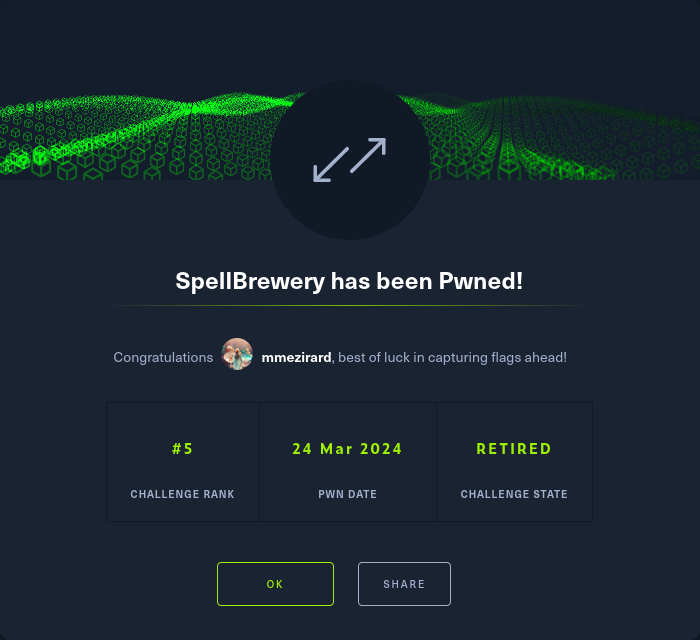

+++
title = "SpellBrewery"
date = "2024-03-24"
description = "This is an easy Reversing challenge."
[extra]
cover = "cover.svg"
toc = true
+++

# Information

**Difficulty**: Easy

**Category**: Reversing

**Release date**: 2024-03-22

**Created by**: [clubby789](https://app.hackthebox.com/users/83743)

**Description**: I've been hard at work in my spell brewery for days, but I
can't crack the secret of the potion of eternal life. Can you uncover the
recipe?

# Setup

I'll complete this challenge using a Kali Linux VM. I'll create a `workspace`
directory at `/` to hold all the files related to this challenge, and the
commands ran on my machine will be prefixed with `❯` for clarity.

# Files

```sh
❯ tree -a "/workspace"
```

```
/workspace
└── rev_spellbrewery
    ├── SpellBrewery
    ├── SpellBrewery.deps.json
    ├── SpellBrewery.dll
    └── SpellBrewery.runtimeconfig.json

<SNIP>
```

This challenge is comprised of a few files. The most interesting are
`SpellBrewery.dll` and `SpellBrewery`.

# Static analysis

Let's start by statically analyzing these two files using the Rizin toolkit.

## Properties

Let's inspect the properties of the `SpellBrewery` binary.

```sh
❯ rz-bin -I "/workspace/rev_spellbrewery/SpellBrewery"
```

```
[Info]
arch     x86
cpu      N/A
baddr    0x00000000
binsz    0x0002ba54
bintype  elf
bits     64
class    ELF64
compiler GCC: (GNU) 4.8.5 20150623 (Red Hat 4.8.5-44) clang version 9.0.0 (tags/RELEASE_900/final)
dbg_file N/A
endian   LE
hdr.csum N/A
guid     N/A
intrp    /lib64/ld-linux-x86-64.so.2
laddr    0x00000000
lang     c++
machine  AMD x86-64 architecture
maxopsz  16
minopsz  1
os       linux
cc       N/A
pcalign  0
relro    full
rpath    $ORIGIN/netcoredeps
subsys   linux
stripped false
crypto   false
havecode true
va       true
sanitiz  false
static   false
linenum  true
lsyms    true
canary   true
PIE      true
RELROCS  true
NX       true
```

This is an ELF 64-bit, LSB executable, which loads dynamic libraries located in
the `netcoredeps` directory in the shared libraries folder.

```sh
❯ rz-bin -I "/workspace/rev_spellbrewery/SpellBrewery.dll"
```

```
[Info]
arch     x86
cpu      N/A
baddr    0x00400000
binsz    0x00003600
bintype  pe
bits     32
retguard false
class    PE32
cmp.csum 0x0000ec7b
compiled Sat Oct 23 11:09:36 2083 UTC+1
compiler N/A
dbg_file N/A
endian   LE
hdr.csum 0x00000000
guid     N/A
intrp    N/A
laddr    0x00000000
lang     cil
machine  i386
maxopsz  16
minopsz  1
os       windows
overlay  false
cc       cdecl
pcalign  0
rpath    N/A
signed   false
subsys   Windows CUI
stripped false
crypto   false
havecode true
va       true
sanitiz  false
static   false
linenum  false
lsyms    false
canary   false
PIE      true
RELROCS  false
NX       true
```

The `SpellBrewery.dll` file is a PE32 binary.

If we run `file` on it, we also discover that it's a .NET assembly.

In fact, the `SpellBrewery` binary uses the `SpellBrewery.dll` library to
provide its functionalities, so I'll focus on this file from now on.

## Libraries

Let's find out which libraries are used by the `SpellBrewery.dll` binary.

```sh
❯ rz-bin -l "/workspace/rev_spellbrewery/SpellBrewery.dll"
```

```
[Libs]
library     
------------
mscoree.dll
```

This binary uses the `mscoree.dll` library, which provides the fundamental
functionalities for programs written in .NET.

## Imports

Now, let's find the list of objects imported by this binary.

```sh
❯ rz-bin -i "/workspace/rev_spellbrewery/SpellBrewery.dll"
```

```
[Imports]
nth vaddr      bind type lib         name        
-------------------------------------------------
1   0x00402000 NONE FUNC mscoree.dll _CorExeMain
```

We only find the `_CorExeMain` function, which is the starting point for DLL
files.

## Exports

Now, let's find the list of objects exported by this binary.

```sh
❯ rz-bin -E "/workspace/rev_spellbrewery/SpellBrewery.dll"
```

```
[Exports]
nth paddr vaddr bind type size lib name 
----------------------------------------
```

There's not debugging information.

## Strings

Finally, let's retrieve the list of strings contained in this binary.

```sh
❯ rz-bin -z "/workspace/rev_spellbrewery/SpellBrewery.dll"
```

```
[Strings]
nth paddr      vaddr      len size section type    string                                                                                                                                                                                                                                                                                                                                                                                                                                                                                                                        
---------------------------------------------------------------------------------------------------------------------------------------------------------------------------------------------------------------------------------------------------------------------------------------------------------------------------------------------------------------------------------------------------------------------------------------------------------------------------------------------------------------------------------------------------------------------------------
0   0x00002e96 0x00406096 15  32   .rsrc   utf16le VS_VERSION_INFO
1   0x00002ef2 0x004060f2 11  24   .rsrc   utf16le VarFileInfo
2   0x00002f12 0x00406112 11  24   .rsrc   utf16le Translation
3   0x00002f36 0x00406136 14  30   .rsrc   utf16le StringFileInfo
4   0x00002f5a 0x0040615a 8   18   .rsrc   utf16le 000004b0
5   0x00002f72 0x00406172 11  24   .rsrc   utf16le CompanyName
6   0x00002f8c 0x0040618c 12  26   .rsrc   utf16le SpellBrewery
7   0x00002fae 0x004061ae 15  32   .rsrc   utf16le FileDescription
8   0x00002fd0 0x004061d0 12  26   .rsrc   utf16le SpellBrewery
9   0x00002ff2 0x004061f2 11  24   .rsrc   utf16le FileVersion
10  0x0000300c 0x0040620c 7   16   .rsrc   utf16le 1.0.0.0
11  0x00003022 0x00406222 12  26   .rsrc   utf16le InternalName
12  0x0000303c 0x0040623c 16  34   .rsrc   utf16le SpellBrewery.dll
13  0x00003066 0x00406266 14  30   .rsrc   utf16le LegalCopyright
14  0x0000308e 0x0040628e 16  34   .rsrc   utf16le OriginalFilename
15  0x000030b0 0x004062b0 16  34   .rsrc   utf16le SpellBrewery.dll
16  0x000030da 0x004062da 11  24   .rsrc   utf16le ProductName
17  0x000030f4 0x004062f4 12  26   .rsrc   utf16le SpellBrewery
18  0x00003116 0x00406316 14  30   .rsrc   utf16le ProductVersion
19  0x00003134 0x00406334 5   12   .rsrc   utf16le 1.0.0
20  0x00003146 0x00406346 16  34   .rsrc   utf16le Assembly Version
21  0x00003168 0x00406368 7   16   .rsrc   utf16le 1.0.0.0
22  0x0000318b 0x0040638b 487 488  .rsrc   ascii   <?xml version="1.0" encoding="UTF-8" standalone="yes"?>\r\n\r\n<assembly xmlns="urn:schemas-microsoft-com:asm.v1" manifestVersion="1.0">\r\n  <assemblyIdentity version="1.0.0.0" name="MyApplication.app"/>\r\n  <trustInfo xmlns="urn:schemas-microsoft-com:asm.v2">\r\n    <security>\r\n      <requestedPrivileges xmlns="urn:schemas-microsoft-com:asm.v3">\r\n        <requestedExecutionLevel level="asInvoker" uiAccess="false"/>\r\n      </requestedPrivileges>\r\n    </security>\r\n  </trustInfo>\r\n</assembly>
```

I don't see anything noteworthy.

# Dynamic analysis

Now that we have an idea of what `SpellBrewery.dll` could be doing, let's see
what it really does. We'll have to use `SpellBrewery` to access its
functionalities.

## Execution

Let's execute this binary on Linux.

```sh
❯ "/workspace/rev_spellbrewery/SpellBrewery"
```

```
1. List Ingredients
2. Display Current Recipe
3. Add Ingredient
4. Brew Spell
5. Clear Recipe
6. Quit
>
```

We're given the choice between six different actions.

First, we can list the ingredients:

```
> 1
Witch's Eye, Bat Wing, Ghostly Essence, Toadstool Extract, Vampire Blood, Mandrake Root, 
Zombie Brain, Ghoul's Breath, Spider Venom, Black Cat's Whisker, Werewolf Fur, Banshee's Wail, 
Spectral Ash, Pumpkin Spice, Goblin's Earwax, Haunted Mist, Wraith's Tear, Serpent Scale, 
Moonlit Fern, Cursed Skull, Raven Feather, Wolfsbane, Frankenstein's Bolt, Wicked Ivy, 
Screaming Banshee Berry, Mummy's Wrappings, Dragon's Breath, Bubbling Cauldron Brew, Gorehound's Howl, Wraithroot, 
Haunted Grave Moss, Ectoplasmic Slime, Voodoo Doll's Stitch, Bramble Thorn, Hocus Pocus Powder, Cursed Clove, 
Wicked Witch's Hair, Halloween Moon Dust, Bog Goblin Slime, Ghost Pepper, Phantom Firefly Wing, Gargoyle Stone, 
Zombie Toenail, Poltergeist Polyp, Spectral Goo, Salamander Scale, Cursed Candelabra Wax, Witch Hazel, 
Banshee's Bane, Grim Reaper's Scythe, Black Widow Venom, Moonlit Nightshade, Ghastly Gourd, Siren's Song Seashell, 
Goblin Gold Dust, Spider Web Silk, Haunted Spirit Vine, Frog's Tongue, Mystic Mandrake, Widow's Peak Essence, 
Wicked Warlock's Beard, Crypt Keeper's Cryptonite, Bewitched Broomstick Bristle, Dragon's Scale Shimmer, Vampire Bat Blood, Graveyard Grass, 
Halloween Harvest Pumpkin, Cursed Cobweb Cotton, Phantom Howler Fur, Wraithbone, Goblin's Green Slime, Witch's Brew Brew, 
Voodoo Doll Pin, Bramble Berry, Spooky Spellbook Page, Halloween Cauldron Steam, Spectral Spectacles, Salamander's Tail, 
Cursed Crypt Key, Pumpkin Patch Spice, Haunted Hay Bale, Banshee's Bellflower, Ghoulish Goblet, Frankenstein's Lab Liquid, 
Zombie Zest Zest, Werewolf Whisker, Gargoyle Gaze, Black Cat's Meow, Wolfsbane Extract, Goblin's Gold, 
Phantom Firefly Fizz, Spider Sling Silk, Widow's Weave, Wraith Whisper, Siren's Serenade, Moonlit Mirage, 
Spectral Spark, Dragon's Roar, Banshee's Banshee, Witch's Whisper, Ghoul's Groan, Toadstool Tango, 
Vampire's Kiss, Bubbling Broth, Mystic Elixir, Cursed Charm
<SNIP>
```

There's a lot of them.

We can also see the current recipe, add an ingredient to the recipe, brew a
spell with the ingredients in our recipe, or clear the recipe.

# Static analysis

## Decompilation

I'll load `SpellBrewery.dll` with the default options using dnSpy.

The source code is actually split into three classes: `Brewery`, `Ingredient`
and `Menu`. The `Brewery` and `Menu` class are singletons.

As usual, I'll start by exploring the `Main` function.

### `Main`

```c#
private static void Main() {
    for (true) {
        switch (Menu.ShowMenu()) {
        case Menu.Choice.ListIngredients:
            Brewery.ListIngredients();
            break;
        case Menu.Choice.DisplayRecipe:
            Brewery.DisplayRecipe();
            break;
        case Menu.Choice.AddIngredient:
            Brewery.AddIngredient();
            break;
        case Menu.Choice.BrewSpell:
            Brewery.BrewSpell();
            break;
        case Menu.Choice.ClearRecipe:
            Brewery.ClearRecipe();
            break;
        }
    }
}
```

This function calls the `ShowMenu` method of `Menu` to display the options,
check the user input and return it if it's valid.

Depending on the value entered by the user, different methods of `Brewery` are
called.

### `ListIngredients`

```c#
private static void ListIngredients() {
    for (int i = 0; i < Brewery.ingredientNames.Length; i++) {
        Console.Write(Brewery.ingredientNames[i] ?? "");

        bool isNotLastIngredient = index + 1 < Brewery.ingredientNames.Length;
        if (isNotLastIngredient) {
            Console.Write(", ");
        }

        bool isSixthIngredientInRow = index % 6 == 5;
        if (isSixthIngredientInRow) {
            Console.Write("\n");
        }

    }
    Console.Write("\n");
}
```

This method writes to the terminal all ingredients contained in the
`ingredientNames` attribute of `Brewery`.

### `Brewery`

```c#
static Brewery() {
    Brewery.ingredientNames = new string[] {
        "Witch's Eye",
        "Bat Wing",
        "Ghostly Essence",
        "Toadstool Extract",
        "Vampire Blood",
        "Mandrake Root",
        "Zombie Brain",
        "Ghoul's Breath",
        "Spider Venom",
        "Black Cat's Whisker",
        "Werewolf Fur",
        "Banshee's Wail",
        "Spectral Ash",
        "Pumpkin Spice",
        "Goblin's Earwax",
        "Haunted Mist",
        "Wraith's Tear",
        "Serpent Scale",
        "Moonlit Fern",
        "Cursed Skull",
        "Raven Feather",
        "Wolfsbane",
        "Frankenstein's Bolt",
        "Wicked Ivy",
        "Screaming Banshee Berry",
        "Mummy's Wrappings",
        "Dragon's Breath",
        "Bubbling Cauldron Brew",
        "Gorehound's Howl",
        "Wraithroot",
        "Haunted Grave Moss",
        "Ectoplasmic Slime",
        "Voodoo Doll's Stitch",
        "Bramble Thorn",
        "Hocus Pocus Powder",
        "Cursed Clove",
        "Wicked Witch's Hair",
        "Halloween Moon Dust",
        "Bog Goblin Slime",
        "Ghost Pepper",
        "Phantom Firefly Wing",
        "Gargoyle Stone",
        "Zombie Toenail",
        "Poltergeist Polyp",
        "Spectral Goo",
        "Salamander Scale",
        "Cursed Candelabra Wax",
        "Witch Hazel",
        "Banshee's Bane",
        "Grim Reaper's Scythe",
        "Black Widow Venom",
        "Moonlit Nightshade",
        "Ghastly Gourd",
        "Siren's Song Seashell",
        "Goblin Gold Dust",
        "Spider Web Silk",
        "Haunted Spirit Vine",
        "Frog's Tongue",
        "Mystic Mandrake",
        "Widow's Peak Essence",
        "Wicked Warlock's Beard",
        "Crypt Keeper's Cryptonite",
        "Bewitched Broomstick Bristle",
        "Dragon's Scale Shimmer",
        "Vampire Bat Blood",
        "Graveyard Grass",
        "Halloween Harvest Pumpkin",
        "Cursed Cobweb Cotton",
        "Phantom Howler Fur",
        "Wraithbone",
        "Goblin's Green Slime",
        "Witch's Brew Brew",
        "Voodoo Doll Pin",
        "Bramble Berry",
        "Spooky Spellbook Page",
        "Halloween Cauldron Steam",
        "Spectral Spectacles",
        "Salamander's Tail",
        "Cursed Crypt Key",
        "Pumpkin Patch Spice",
        "Haunted Hay Bale",
        "Banshee's Bellflower",
        "Ghoulish Goblet",
        "Frankenstein's Lab Liquid",
        "Zombie Zest Zest",
        "Werewolf Whisker",
        "Gargoyle Gaze",
        "Black Cat's Meow",
        "Wolfsbane Extract",
        "Goblin's Gold",
        "Phantom Firefly Fizz",
        "Spider Sling Silk",
        "Widow's Weave",
        "Wraith Whisper",
        "Siren's Serenade",
        "Moonlit Mirage",
        "Spectral Spark",
        "Dragon's Roar",
        "Banshee's Banshee",
        "Witch's Whisper",
        "Ghoul's Groan",
        "Toadstool Tango",
        "Vampire's Kiss",
        "Bubbling Broth",
        "Mystic Elixir",
        "Cursed Charm"
    };

    Brewery.correctIngredientNames = new string[] {
        "Phantom Firefly Wing",
        "Ghastly Gourd",
        "Hocus Pocus Powder",
        "Spider Sling Silk",
        "Goblin's Gold",
        "Wraith's Tear",
        "Werewolf Whisker",
        "Ghoulish Goblet",
        "Cursed Skull",
        "Dragon's Scale Shimmer",
        "Raven Feather",
        "Dragon's Scale Shimmer",
        "Ghoulish Goblet",
        "Cursed Skull",
        "Raven Feather",
        "Spectral Spectacles",
        "Dragon's Scale Shimmer",
        "Haunted Hay Bale",
        "Wraith's Tear",
        "Zombie Zest Zest",
        "Serpent Scale",
        "Wraith's Tear",
        "Cursed Crypt Key",
        "Dragon's Scale Shimmer",
        "Salamander's Tail",
        "Raven Feather",
        "Wolfsbane",
        "Frankenstein's Lab Liquid",
        "Zombie Zest Zest",
        "Cursed Skull",
        "Ghoulish Goblet",
        "Dragon's Scale Shimmer",
        "Cursed Crypt Key",
        "Wraith's Tear",
        "Black Cat's Meow",
        "Wraith Whisper"
    };

    Brewery.recipe = new List<Ingredient>();
}
```

The constructor of `Brewery` defines three attributes:

- `ingredientNames` holds all the ingredients names.

- `correctIngredientNames` holds all the correct ingredients names (more on that
  later).

- `recipe` holds the ingredients in the current recipe.

### `DisplayRecipe`

```c#
private static void DisplayRecipe() {
    bool isRecipeEmpty = Brewery.recipe.Count == 0;
    
    if (isRecipeEmpty) {
        Console.WriteLine("There are no current ingredients");
    } else {
        Console.WriteLine(string.Join<Ingredient>(", ", Brewery.recipe));
    }
}
```

This method writes to the terminal all the ingredients contained in the `recipe`
attribute of `Brewery` if it's not empty.

### `AddIngredient`

```c#
private static void AddIngredient()
{
    Console.Write("What ingredient would you like to add? ");
    string ingredientName;

    for (true)
    {
        ingredientName = Console.ReadLine();
        bool isValid = !Brewery.ingredientNames.Contains(ingredientName);

        if (!isValid)
        {
            break;
        }

        Console.WriteLine("Invalid ingredient name");
    }

    Brewery.recipe.Add(new Ingredient(ingredientName));

    string article = ("aeiou".Contains(char.ToLower(ingredientName[0])) ? "an" : "a");
    DefaultInterpolatedStringHandler interpolatedStringHandler = new DefaultInterpolatedStringHandler(41, 2);
    interpolatedStringHandler.AppendLiteral("The cauldron fizzes as you toss in ");
    interpolatedStringHandler.AppendFormatted(article);
    interpolatedStringHandler.AppendLiteral(" '");
    interpolatedStringHandler.AppendFormatted(ingredientName);
    interpolatedStringHandler.AppendLiteral("'...");
    
    Console.WriteLine(interpolatedStringHandler.ToStringAndClear());
}
```

This method asks the user to enter an ingredient name to add to the recipe. If
the ingredient is valid, it's added to the `recipe` attribute of `Brewery`.

### `BrewSpell`

```c#
private static void BrewSpell() {
    bool isRecipeEmpty = Brewery.recipe.Count < 1;

    if (isRecipeEmpty) {
        Console.WriteLine("You can't brew with an empty cauldron");
    } else {
        byte[] encodedRecipe = Brewery.recipe.Select((Ingredient ingredient) =>
            (byte)(Array.IndexOf<string>(Brewery.ingredientNames, ingredient.ToString()) + 32)).ToArray<byte>();

        bool isRecipeCorrect = Brewery.recipe.SequenceEqual(Brewery.correctIngredientNames.Select((string name) => new Ingredient(name)));

        if (isRecipeCorrect) {
            Console.WriteLine("The spell is complete - your flag is: " + Encoding.ASCII.GetString(encodedRecipe));
            Environment.Exit(0);
        } else {
            Console.WriteLine("The cauldron bubbles as your ingredients melt away. Try another recipe.");
        }
    }
}
```

This method starts by checking if the recipe is empty. If it's not, it encodes
the ingredients in the recipe and create a byte array.

It also checks if the recipe contains exactly the same ingredients as the
`correctIngredientNames` attribute of `Bewery`, and if they are in the same
order. If that's the case, the program prints the value of the encoded recipe
byte array as a string.

### `ClearRecipe`

```c#
private static void ClearRecipe() {
    Brewery.recipe.Clear();
    Console.WriteLine("You pour the cauldron down the drain. A fizzing noise and foul smell rises from it...");
}
```

This method clears the `recipe` attribute of `Brewery`.

# Putting everything together

To obtain the flag, we should create a recipe holding the
`correctIngredientNames` in the same order.

Let's execute `SpellBrewer` once again, and let's add all of these ingredients
to the recipe.

Then, let's brew a spell:

```
> 4
The spell is complete - your flag is: HTB{y0ur3_4_r34l_p0t10n_m45st3r_n0w}
```

We got the flag!

# Afterwords



That's it for this box! 🎉

I rated this challenge as 'Very easy'. The decompiled code was really close to
the reality, and it was easy to understand and to find how to get the flag.

Thanks for reading!
