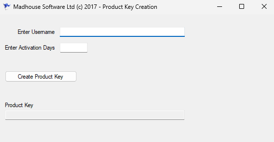
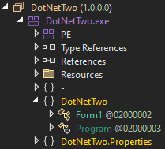

+++
title = "The Art of Reversing"
date = "2023-11-26"
description = "This is an easy Reversing challenge."
[extra]
cover = "cover.svg"
toc = true
+++

# Information

**Difficulty**: Easy

**Category**: Reversing

**Release date**: 2017-06-29

**Created by**: [Thiseas](https://app.hackthebox.com/users/93)

**Description**: This is a program that generates product keys for a specific software brand. The input is the client username and the number of days that the sofware will remain active on the client. The output is the product key that client will use to activate the software package. We just have the following product key: `cathhtkeepaln-wymddd`. Could you find the corresponding username say `A` and the number of activation days say `B` given as input? The flag you need to enter must follow this format: `HTB{AB}`.

# Setup

I'll complete this challenge mostly using a Windows VM, even though I prefer using Linux, since the binary is actually meant to be run on Windows (as we'll see later). I'll still use Linux at the beginning to run a few commands though, as there's no Windows equivalent for these. I'll create a `Workspace` directory in `C:\` on Windows, and a `workspace` directory at `/` on Linux to hold all the files related to this challenge. The commands ran on my machine will be prefixed with `❯` for clarity.

# Identification

```sh
❯ tree -a "/workspace"
```

```
/workspace
└── TheArtOfReversing.exe
```

The challenge is comprised of a single file named `TheArtOfReversing.exe`, so we can infer that it's meant to be run on Windows. But let's confirm this by running `file` on it.

```sh
❯ file /workspace/TheArtOfReversing.exe
```

```
/workspace/TheArtOfReversing.exe: PE32 executable (GUI) Intel 80386 Mono/.Net assembly, for MS Windows, 3 sections
```

Okay, so it looks like this is a PE32 executable, GUI, made with .NET. That's interesting!

Let's find more information about it using `zn-bin`.

```sh
❯ rz-bin -I /workspace/TheArtOfReversing.exe
```

```
[Info]
arch     x86
cpu      N/A
baddr    0x00400000
binsz    0x000b0e00
bintype  pe
bits     32
retguard false
class    PE32
cmp.csum 0x000b914b
compiled Wed Jun 28 21:09:10 2017 UTC+1
compiler N/A
dbg_file C:\Users\aveni\OneDrive\Programs\C#\HackTheBox.AJV\DotNetTwo\obj\Release\DotNetTwo.pdb
endian   LE
hdr.csum 0x00000000
guid     56C0F3BC6E2C46948FFAF17F42A10F9B1
intrp    N/A
laddr    0x00000000
lang     cil
machine  i386
maxopsz  16
minopsz  1
os       windows
overlay  false
cc       cdecl
pcalign  0
rpath    N/A
signed   false
subsys   Windows GUI
stripped false
crypto   false
havecode true
va       true
sanitiz  false
static   false
linenum  false
lsyms    false
canary   false
PIE      true
RELROCS  false
NX       true
```

This confirms the information we got with `file`. But now, we also know that it uses LE notation!

Interestingly, there's not much protections in place. That's always good to note, even though this is simply a reversing challenge.

# Libraries

Let's find the list of libraries used by this binary.

```sh
❯ rz-bin -l /workspace/TheArtOfReversing.exe
```

```
[Libs]
library     
------------
mscoree.dll
```

So this binary uses the `mscoree.dll` library, which provides the fundamental functionalities for the Microsoft.NET framework.

# Imports

Now, let's find the list of imports used by this binary.

```sh
❯ rz-bin -i /workspace/TheArtOfReversing.exe
```

```
[Imports]
nth vaddr      bind type lib         name        
-------------------------------------------------
1   0x00402000 NONE FUNC mscoree.dll _CorExeMain
```

So this binary imports the `_CorExeMain` from the `mscoree.dll` library. According to Microsoft, this function:

> Initializes the common language runtime (CLR), locates the managed entry point in the executable assembly's CLR header, and begins execution.
>
> — [Microsoft](https://learn.microsoft.com/en-us/dotnet/framework/unmanaged-api/hosting/corexemain-function)

# Symbols

Let's find the list of symbols for this binary.

```sh
❯ rz-bin -s /workspace/TheArtOfReversing.exe
```

```
[Symbols]
nth paddr      vaddr      bind type size lib         name                                                 
----------------------------------------------------------------------------------------------------------
1   0x00000200 0x00402000 NONE FUNC 0    mscoree.dll imp._CorExeMain
0   0x00000251 0x00402051 NONE FUNC 31               DotNetTwo::Form1::.ctor
0   0x00000271 0x00402071 NONE FUNC 32               DotNetTwo::Form1::Do
0   0x000002a0 0x004020a0 NONE FUNC 16               DotNetTwo::Form1::GetPer
0   0x000002bc 0x004020bc NONE FUNC 125              DotNetTwo::Form1::GetPer
0   0x0000033a 0x0040213a NONE FUNC 11               DotNetTwo::Form1::nPr
0   0x00000354 0x00402154 NONE FUNC 20               DotNetTwo::Form1::FcDv
0   0x00000369 0x00402169 NONE FUNC 18               DotNetTwo::Form1::Fc
0   0x00000388 0x00402188 NONE FUNC 390              DotNetTwo::Form1::ToR
0   0x0000051c 0x0040231c NONE FUNC 48               DotNetTwo::Form1::DoR
0   0x00000558 0x00402358 NONE FUNC 330              DotNetTwo::Form1::buttonCreateProductKey_Click
0   0x000006b0 0x004024b0 NONE FUNC 80               DotNetTwo::Form1::textBoxDays_TextChanged
0   0x00000701 0x00402501 NONE FUNC 30               DotNetTwo::Form1::Dispose
0   0x0000072c 0x0040252c NONE FUNC 1009             DotNetTwo::Form1::InitializeComponent
0   0x00000b1e 0x0040291e NONE FUNC 22               DotNetTwo::Program::Main
0   0x00000b35 0x00402935 NONE FUNC 7                DotNetTwo.Properties::Resources::.ctor
0   0x00000b3d 0x0040293d NONE FUNC 43               DotNetTwo.Properties::Resources::get_ResourceManager
0   0x00000b69 0x00402969 NONE FUNC 6                DotNetTwo.Properties::Resources::get_Culture
0   0x00000b70 0x00402970 NONE FUNC 7                DotNetTwo.Properties::Resources::set_Culture
0   0x00000b78 0x00402978 NONE FUNC 6                DotNetTwo.Properties::Settings::get_Default
0   0x00000b7f 0x0040297f NONE FUNC 7                DotNetTwo.Properties::Settings::.ctor
0   0x00000b87 0x00402987 NONE FUNC 21               DotNetTwo.Properties::Settings::.cctor
```

Okay, so this binary interacts with `Form1` from `DotNetTwo`. This confirms that we are dealing with a GUI, as the execution probably opens a form listening for user interactions.

# Strings

Finally, let's retrieve the list of strings contained in this binary.

```sh
❯ rz-bin -z /workspace/TheArtOfReversing.exe
```

```
[Strings]
nth paddr      vaddr      len size section type    string                                                                                                                                                                                                                                                                                                                                                                                                                                                                                                                        
---------------------------------------------------------------------------------------------------------------------------------------------------------------------------------------------------------------------------------------------------------------------------------------------------------------------------------------------------------------------------------------------------------------------------------------------------------------------------------------------------------------------------------------------------------------------------------
0   0x0005b51f 0x0045df1f 8   36   .rsrc   utf32le \t\n\v\v\v\n\t\a
1   0x0005b91c 0x0045e31c 16  17   .rsrc   ascii   XXY;SSS9gghkYYZG
2   0x0005bd14 0x0045e714 7   8    .rsrc   ascii   nnoNyyz
<SNIP>
334 0x000b07e6 0x004b31e6 16  34   .rsrc   utf16le Assembly Version
335 0x000b0808 0x004b3208 7   16   .rsrc   utf16le 1.0.0.0
336 0x000b082b 0x004b322b 487 488  .rsrc   ascii   <?xml version="1.0" encoding="UTF-8" standalone="yes"?>\r\n\r\n<assembly xmlns="urn:schemas-microsoft-com:asm.v1" manifestVersion="1.0">\r\n  <assemblyIdentity version="1.0.0.0" name="MyApplication.app"/>\r\n  <trustInfo xmlns="urn:schemas-microsoft-com:asm.v2">\r\n    <security>\r\n      <requestedPrivileges xmlns="urn:schemas-microsoft-com:asm.v3">\r\n        <requestedExecutionLevel level="asInvoker" uiAccess="false"/>\r\n      </requestedPrivileges>\r\n    </security>\r\n  </trustInfo>\r\n</assembly>
```

Okay, so this binary contains plenty of strings, `337` to be exact. I quickly skimmed through it, but nothing stood out.

# Execution

Time to spin up Windows and see how this binary behaves!



We are prompted to enter a username and a number representing the activation days. Let's enter `foo` for the username and `12` for the activation days, and click on the `Create Product Key` button.


Okay, so the number we entered is invalid. Let's enter  `16` instead.


This time we got a product key: `ofo-jwy`.

If we read the challenge's description, we understand that we have to find the username and the number of activation days used to obtain the product key `cathhtkeepaln-wymddd`.

# Decompilation

Now that we have an of idea of how this .NET assembly behaves and of what its dependencies are, let's decompile it and explore it using the revived version of [dnSpy](https://github.com/dnSpyEx/dnSpy). I'm going to load `TheArtOfReversing.exe` and focus on the `DotNetTwo` tab, since it contains the functions we're interested in.

## Components



This part contains two components : `Form1` and `Program`, themselves comprised of many functions as we saw in the [Symbols](#symbols) section. Let's start with `Main`, as it's the entry point for this binary.

## `Main`

```c#
[STAThread]
private static void Main()
{
	Application.EnableVisualStyles();
	Application.SetCompatibleTextRenderingDefault(false);
	Application.Run(new Form1());
}
```

This function simply creates a new `Form1` and runs it.

If we look at the `Form1` functions, we see that there's plenty of them, since this class actually extends `Form`. Therefore it inherits all its functions.

However, what we're interesting in is the function to create the product key, which is likely called when we click the 'Create Product Key' button. The function corresponding to this action is named `buttonCreateProductKey_Click`, so this looks like a great entry point for our exploration!

## `buttonCreateProductKey_Click`

```c#,linenos
private void buttonCreateProductKey_Click(object sender, EventArgs e)
{
	if (this.textBoxUsername.Text.TrimEnd(new char[0]) == "" || this.textBoxDays.Text.TrimEnd(new char[0]) == "")
	{
		MessageBox.Show("Both Username and Number of Days are mandatory!");
		return;
	}
	string text = this.textBoxUsername.Text.TrimEnd(new char[0]);
	int num = Convert.ToInt32(this.textBoxDays.Text);
	this.nToStop = 0;
	this.nCounter = 0;
	this.bContinue = true;
	this.ssOut = "";
	if (text.Length < 3)
	{
		MessageBox.Show("Username must be more than 2 characters!");
		return;
	}
	if (num <= 15 || num > 3650)
	{
		MessageBox.Show("Activation Days must be between 15 and 3650!");
		return;
	}
	this.textBoxProductKey.Text = "";
	Application.DoEvents();
	Cursor.Current = Cursors.WaitCursor;
	int num2 = this.nPr(text.Length, text.Length);
	this.nToStop = num2 / 2;
	char[] array = text.ToCharArray();
	this.GetPer(array);
	string text2 = this.ToR(num);
	text2 = this.DoR(text2);
	Cursor.Current = Cursors.Default;
	this.textBoxProductKey.Text = this.ssOut + "-" + text2;
}
```

Okay, there's a lot going on here. We can grossiereent split the function into three parts.

### Checks

The lines `3` to `7` check if the given user inputs are empty. If this is the case, they print a message and return from the function.

The username is then saved into the `text` variable, and the number of days into `num`.

Next, he lines `14` to `18` check if the username is less than `3` characters long. If this is the case, they print a message and return from this function.

Finally, the lines `19` to `23` if the number of days is between `15` and `3650`. If this is not the case, they print a message and return.

### Calculations

First of all, the text of the `textBoxProductKey` box is initialized to an empty string.

Then, the line `27` calls the `nPr` function on the username length, and saves the output into `num2`. We'll check it later, let's continue our analysis of this function for now.

The line `28` sets a variable named `nToStop` to `num2 / 2`.

The line `29` splits all the characters of the username into an array, and saves it into array.

The line `30` calls `GetPer` on this array. Again, we'll explore it later.

The line `31` applies the `ToR` function to the number of days we entered, and the result is saved into the `text2` variable. Again a function we'll investigate later.

The line `32` assigns `text2` to the result of the `DoR` function call. There's really a lot of functions involved in this!

### Display

Finally, the line `34` changes the text of the `textBoxProductKey` box to a string made of the `ssOut` variable value and the `text2` value, separated by `-`.

Okay, so now we have a better ideas of the steps taken by this function. But there's still a lot of functionalities to uncover...

## `nPr`

```c#
public int nPr(int n, int r)
{
	return this.FcDv(n, n - r);
}
```

This function just calls another function, `FcDv`, and returns the result. The difference is the arguments passed down to the `FcDv` function.

## `FcDv`

```c#
private int FcDv(int topFc, int divFc)
{
	int num = 1;
	for (int i = topFc; i > divFc; i--)
	{
		num *= i;
	}
	return num;
}
```

This function actually calculates the factorial of a number from `topFc` down to `divFc`.

---

With all this new knowledge, we can conclude than the line `27` of the `buttonCreateProductKey_Click` function actually calculates the factorial of the length of the username and saves it into `num2`.

## `GetPer` (`char[]` arguments)

```c#
public void GetPer(char[] word)
{
	int num = word.Length - 1;
	this.GetPer(word, 0, num);
}
```

This function calls a private function with the same name, but different arguments.

## `GetPer` (`char[], int, int` arguments)

```c#,linenos
private void GetPer(char[] word, int k, int m)
{
	if (!this.bContinue)
	{
		return;
	}
	if (k == m)
	{
		this.nCounter++;
		if (this.nCounter == this.nToStop)
		{
			this.ssOut = new string(word);
			this.bContinue = false;
			return;
		}
	}
	else
	{
		for (int i = k; i <= m; i++)
		{
			this.Do(ref word[k], ref word[i]);
			this.GetPer(word, k + 1, m);
			this.Do(ref word[k], ref word[i]);
		}
	}
}
```

This function is a recursive one, and calls itself at lines `21` and `23`. The line `22` also calls the `Do` function.

## `Do`

```c#
private void Do(ref char a, ref char b)
{
	if (a == b)
	{
		return;
	}
	a ^= b;
	b ^= a;
	a ^= b;
}
```

This function is actually really simple! It switches the values of `a` and `b` if they are different.

---

We can assume that `GetPer` is responsible for scrambling our username!

## `ToR`

```c#
public string ToR(int number)
{
	if (number < 0 || number > 3999)
	{
		return "";
	}
	if (number < 1)
	{
		return string.Empty;
	}
	if (number >= 1000)
	{
		return "M" + this.ToR(number - 1000);
	}
	if (number >= 900)
	{
		return "CM" + this.ToR(number - 900);
	}
	if (number >= 500)
	{
		return "D" + this.ToR(number - 500);
	}
	if (number >= 400)
	{
		return "CD" + this.ToR(number - 400);
	}
	if (number >= 100)
	{
		return "C" + this.ToR(number - 100);
	}
	if (number >= 90)
	{
		return "XC" + this.ToR(number - 90);
	}
	if (number >= 50)
	{
		return "L" + this.ToR(number - 50);
	}
	if (number >= 40)
	{
		return "XL" + this.ToR(number - 40);
	}
	if (number >= 10)
	{
		return "X" + this.ToR(number - 10);
	}
	if (number >= 9)
	{
		return "IX" + this.ToR(number - 9);
	}
	if (number >= 5)
	{
		return "V" + this.ToR(number - 5);
	}
	if (number >= 4)
	{
		return "IV" + this.ToR(number - 4);
	}
	if (number >= 1)
	{
		return "I" + this.ToR(number - 1);
	}
	return "";
}
```

Waouh, that function looks massive and complicated! But it's actually really easy. It's simply a function to calculate the roman numerals representation of a number.

---

The `ToR` function is applied to the number of days we entered, and the result is saved into the `text2` variable. Therefore, `text2` contains the roman numerals representation of the number of days we entered.

## `DoR`

```c#
public string DoR(string s)
{
	char[] array = s.ToCharArray();
	Array.Reverse(array);
	for (int i = 0; i < array.Length; i++)
	{
		array[i] += '\u0001';
	}
	return new string(array).ToLower();
}
```

This function convert the given argument to an array of characters, reverses this array, adds 1 to the unicode representation of all the characters, and returns the array where all characters are lowercase.

---

We can assume that after this function is called at the line `32` of `buttonCreateProductKey_Click`, the roman numerals representation of the number of days we entered is reversed, and that each character is shifted by 1 alphabetically to the right.

# Putting everything together

## Unscrambling the username

We have to find the username input that produces `cathhtkeepaln`. According to our exploration of the binary, the username is scrambled. The issue is that we don't really know how the username is scrambled, but what we do know is that its lenght is not modified. Therefore, the username must be `12` characters long.

Let's execute the program and enter `abcdefghijklm` as the username and see how it's scrambled. We can enter anything as the number of days, we're not interested in that at the moment.


Okay, so `abcdefghijklm` becomes `cbefamdlghjik`. Hence, if we obtained `cathhtkeepaln`, the input must have been `hacktheplanet`!

## Reversing the number of days

Now, we just need to find the number of days input that produces `wymddd`. To to so, we have to do the same calculations as the program, but in the reverse order.

First, we have to alphabetically shift all letters to the left. Therefore, `wymddd` becomes `vxlccc`.

Then, we have to reverse the characters of this string. It becomes `ccclxv`.

Finally, we have to find the number corresponding to this roman numerals representation. It's `365`!

Thus, the username used to generate this product key is `hacktheplanet`, and the number of days is `365`!

## Testing

Let's make sure that this is correct.


And it is. Great!

# Afterwords


That's it for this challenge! I'm fairly new to reverse engineering, so I didn't know about .NET decompilers. At first I used Ghidra to disassembly this binary, which was way too complicated. With the right tool, completing this challenge was straightforward, albeit a bit long, as there's quite a lot of functions being called on the user inputs, especially on the number of days.

Thanks for reading!
