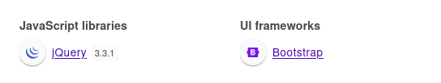
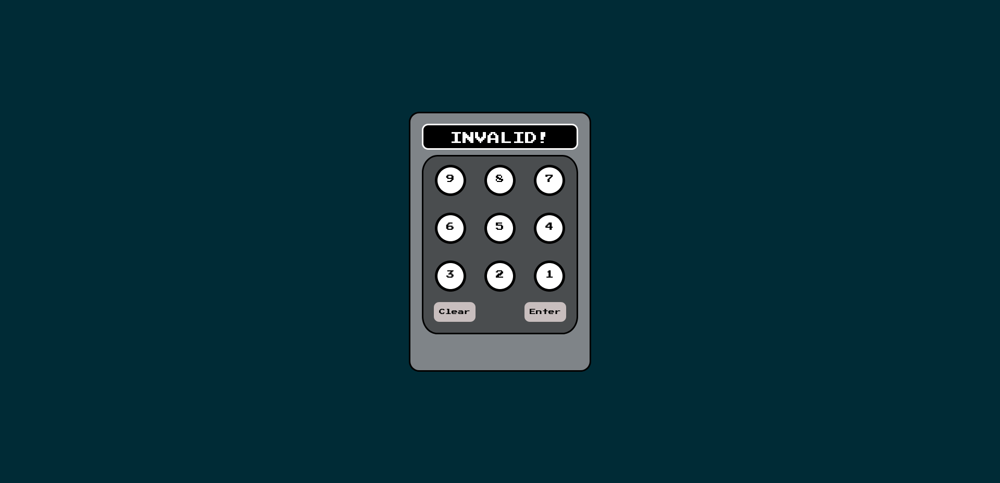

+++
title = "Trapped Source"
date = "2024-03-16"
description = "This is a very easy Web challenge."
[extra]
cover = "cover.svg"
toc = true
+++

# Information

**Difficulty**: Very easy

**Category**: Web

**Release date**: 2023-05-23

**Created by**: [makelaris](https://app.hackthebox.com/users/107)

**Description**: Intergalactic Ministry of Spies tested Pandora's movement and
intelligence abilities. She found herself locked in a room with no apparent
means of escape. Her task was to unlock the door and make her way out. Can you
help her in opening the door?

# Setup

I'll complete this challenge using a Kali Linux VM.

# Socket `94.237.56.188:36374`

## Fingerprinting

Let's gather data about the service associated with the open TCP port we've been
given.

```sh
❯ nmap -sS "94.237.56.188" -p "36374" -sV
```

```
<SNIP>
PORT      STATE SERVICE VERSION
36374/tcp open  unknown
<SNIP>
```

Let's do the same for the UDP port.

```sh
❯ nmap -sU "94.237.56.188" -p "36374" -sV
```

```
<SNIP>
PORT      STATE  SERVICE VERSION
36374/udp closed unknown
<SNIP>
```

## Scripts

Let's run `nmap`'s default scripts on the TCP service to see if they can find
additional information.

```sh
❯ nmap -sS "94.237.56.188" -p "36374" -sC
```

```
<SNIP>
PORT      STATE SERVICE
36374/tcp open  unknown
<SNIP>
```

## Exploration

Let's browse to `http://94.237.56.188:36374/`:


We're presented a vault.

## Fingerprinting

Let's fingerprint the technologies used by this web page with the
[Wappalyzer](https://www.wappalyzer.com/) extension.



If we check the HTTP headers of the response, we find a `Server` header
indicating that the server is using the Werkzeug library `2.3.4` for Python
`3.8.16`.

## Exploration

I tried to enter a random PIN, but it fails:



## Source code review

If we check the source code of the web page, we find this `<script>` tag:

```html
<script>
    window.CONFIG = window.CONFIG || {
        buildNumber: "v20190816",
        debug: false,
        modelName: "Valencia",
        correctPin: "1478",
    }
</script>
```

The correct PIN is written in cleartext: it's `1478`!

## Exploration

Back to the website, if we enter the PIN we just found, it fails!

## Source code review

If we check the source code of the website once again, we find a link to
`/script.js`.

```js
currentPin = [];

const checkPin = () => {
    pin = currentPin.join("");

    if (CONFIG.correctPin == pin) {
        fetch("/flag", {
            method: "POST",
            headers: {
                "Content-Type": "application/json",
            },
            body: JSON.stringify({
                pin: CONFIG.correctPin,
            }),
        })
            .then((data) => data.json())
            .then((res) => {
                $(".lockStatus").css("font-size", "8px");
                $(".lockStatus").text(res.message);
            });
        return;
    }

    $(".lockStatus").text("INVALID!");
    setTimeout(() => {
        reset();
    }, 3000);
};

const unlock = (pin) => {
    currentPin.push(pin);

    if (currentPin.length > 4) return;

    $(".lockStatus").text(currentPin.join(" "));
};

const reset = () => {
    currentPin.length = 0;
    $(".lockStatus").css("font-size", "x-large");

    $(".lockStatus").text("LOCKED");
};
```

The `checkPin` function is the most interesting here. If the correct PIN is
entered, a POST request is sent to `/flag` with the JSON data:

```json
{
    "pin":"1478"
}
```

Since the `currentPin` variable is never updated, the correct PIN is never
entered, so the request to the endpoint is never sent.

What we can do is manually calling the `unlock` function with the parameter
`1478` to update the `currentPin` array. Then, if we press the 'Enter' button,
the `checkPin` gets executed, and...


We get the flag: `HTB{vi3w_cli13nt_s0urc3_S3cr3ts!}`!

# Afterwords


That's it for this box! 🎉

I rated this challenge as 'Piece of cake'. It just required to read the source
code of the page really, and to understand what it does.

Thanks for reading!
